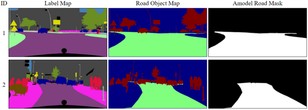
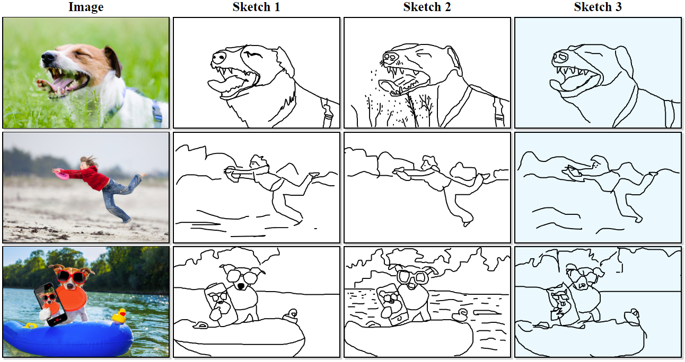
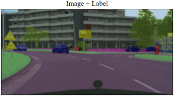

# HTML4Vision
A simple HTML visualization tool for computer vision research
[https://github.com/mtli/HTML4Vision](https://github.com/mtli/HTML4Vision)

<p align="center">
    
</p>

- Easy [table description and generation](#table-description-and-generation) for algorithm comparison and pipeline visualization
- Handy [formatting controls](#formatting) to make pretty figures
- [Web publishing](#web-publishing) for remote browsering
- [Interactive tables](#interactive-tables), able to **sort** and toggle display states
- [Tile images](#Tile-images) with optional captions and hyperlinks

## Installation
```
pip install html4vision
```
[](https://badge.fury.io/py/HTML4Vision)

## Table description and generation

You can use glob patterns (e.g. `results/*_method_2.png`) to specify the content and use `imagetable()` to generate the table automatically.
```python
from html4vision import Col, imagetable

# table description
cols = [
    Col('id1', 'ID'),                                               # make a column of 1-based indices
    Col('img', 'Label Map', 'images/road_*_label.png'),             # specify image content for column 2
    Col('img', 'Road Object Map', 'images/road_*_roadobj.png'),     # specify image content for column 3
    Col('img', 'Amodel Road Mask', 'images/road_*_amodelroad.png'), # specify image content for column 4
]

# html table generation
imagetable(cols)
```

<p align="center">
    
</p>

Example: `examples/basic.py`

### Descriptor syntax

The table is described by a list of `Col` objects. 
```
Col(type, name, content, subset, style, href)
```
- `type`: 'text' for text, 'img' for images, 'overlay' for [image overlay](#image-overlay), 'id0' for zero-based indices and 'id1' for one-based indices.
- `name`: the name of the column.
- `content`: for images (both 'img' and 'overlay'), it is a [glob pattern](https://docs.python.org/3/library/glob.html) or a list of the image paths; for text, it is a list of strings; it is `None` for all other types (indexing is automatic).
- `subset`: subset selection of the `content` provided. If `subset` is a single integer, it is interpreted as length `n` and the first `n` items are selected; if `subset` is a `tuple`, it is interpreted in the form of `(start, stop)` or `(start, step, stop)`; if `subset` is a `list`, it is interpreted as a list of indices to be selected.
- `style`: a string of CSS rules for the entire column. See [styling through CSS](#styling-through-CSS) for more.
- `href`: either a [glob pattern](https://docs.python.org/3/library/glob.html) or a list of URLs, works in the same way as `content` for `img` columns.

### Generation syntax

Basic syntax:
```python
imagetable(
    # contents
    cols, out_file='index.html', title='',
    # additional contents
    summary_row=None, copyright=True,
    # modifiers
    pathrep=None, sortcol=None,
    # style
    imsize=None, imscale=1, summary_color=None, sticky_header=False, sort_style=None, zebra=False, style=None,
    # interaction
    overlay_toggle=False, sortable=False,
)
```
The only required argument is `cols`, which is a sequence of `Col` objects, specifying the content of the table. `out_file` optionally names the output file while `title` sets the title of the generated HTML page.

The meaning and format for other arguments can be found in respective sections
- [generating the HMTL file to another folder](#search-path-and-publish-path): `pathrep`.
- [size control](#size-control): `imsize` and `imscale`.
- [sorting](#sorting): `sortcol`, `sortable`, `sticky_header`, `sort_style`, `zebra`, `summary_row` and `summary_color`.
- [display toggle](#display-toggle): `overlay_toggle`.
- [styling through CSS](#styling-through-CSS): `style`.

## Web publishing

Web publishing is designed for sharing the visualized results. Typically it can be used for sharing the results with others or viewing the results on a remote compute node without downloading them in advance. Of course, it can also be used as a general purpose HTTP server.

The script provided here is functionally similar to the `SimpleHTTPServer` in Python 2 and serves the files in the current directory. It supports both Python 2 & 3 and uses mutiple threads for a much better web experience. For security reasons, directory browsing is disabled and accessing files outside of the current directory is not allowed. So you need to type in the exact HTML file name (e.g. `http://127.0.0.1:6096/index.html`) to access.

Change the current directory to the directory you want to serve and run
```
python -m html4vision.server
```
The default port is 6096. To specify a port (e.g. 23333), run
```
python -m html4vision.server 23333
```

## Search path and publishing path
The search path, the path used to look for the images in the python script, might be different from the publishing path, the path that is encoded in the generated HTML. It is not uncommon to generate the HTML file to a path other than the current folder. The `pathrep` argument is designed for this case. It can be a string, or a tuple of two strings. The former specifies the part of path to be removed while the latter specifies the one replacing it.

Example: `examples/pathrep.py`

## Formatting

### Size control

The image size is controlled by `imsize` and `imscale` arguments. Note that all scaling is done through Javascript which takes place after the content of the webpage is loaded.

`imsize` can be either a single index or a `tuple` or a `list` of width and height. If it is a single index, it means scaling the images in all other columns to match the corresponding image in the column specified by the index. The index is zero-based and refers to the items in the list of `Col` objects. Understanding the indexing is important when you also use image overlay where two objects describe a single column. For example, you can scale the intermediate feature maps of a convolutional nerual network (CNN) to match the size of the input image. If `imsize` is a `tuple` or a `list` of width and height, then all images will be scaled to that size.

`imscale` is a factor to scale the image. When used in combination with `imsize`, the `imscale` is applied after the effects of `imsize`.

### Styling through CSS

The benefit of an HTML table is the freedom to customize styles with CSS. Below is an example of setting the image border and box shadows, and highlighting a particular column.

<p align="center">
    
</p>


Example: `examples/formatting.py`


### Image overlay

<p align="center">
    
</p>

Two consecutive `Col` objects form a single image column. The first `Col` object describes the bottom image while the second describes the top image. Their types need to be 'img' and 'overlay' respectively. If the top image by itself is not transparent, you can specify its opacity by adding `opacity: 0.5` (value range from 0 to 1) to the `style` field.

Example: `examples/overlay.py`


## Interactive tables

### Sorting

The sorting feature comes in handy when you have statistics for each data point in the dataset. A one-time sorting can be done at HTML generation. You can specify `sortcol` to an index of the column based which you want to sort. Furthermore, you can enable post-generation interactive sorting by setting `sortable` to `True`.

Once interactive sorting is enabled, a style template can be specified with `sort_style`. For a list of templates, check files contains "theme" [here](https://cdnjs.com/libraries/jquery.tablesorter/2.30.7). Zebra stripes can be added to the table if `zebra` is set to `True`. When you have too many columns, it might be useful to enable (set `sticky_header` to `True`) to keep track of the columns as you scroll down the page. Note that some features may seem irrelevant to sorting, yet they only work when `sortable` is `True`.

In addition, you will find how to specify a summary row with a particular color in the following example.

Example: `examples/sort.py`

### Display toggle

When image overlay is used and `overlay_toggle` is set to `True`, you can click the overlaid images to toggle image overlay.

Example: `examples/overlay.py`

## Hyperlinks
The `href` field is designed to create a clickable link for table items. All column types support `href` as long as the column content is non-empty. It works in the same way as the `content` field of `img` columns &mdash; it will synergize with `subset` selection and the `pathrep` argument if specified (see [here](#search-path-and-publish-path)). For overlay columns, `href` should be attached to the preceding `img` column and it cannot be used together with `overlay_toggle=True` since they both bind to the mouse click.

Example: `examples/href.py`


## Tile images
In addition to the main function `imagetable`, we provide another function to generate a grid display of a list of images: `imagetile`. The layout is specified through `n_col`, which means each row has items no more than `n_col`. The number of rows is calculated automatically. Optionally, you can add captions and URLs to the images.


Basic syntax:
```python
imagetile(
    # contents
    content, n_col=3, out_file='index.html', title='',
    # additional contents
    caption=None, href=None, subset=None, copyright=True,
    # modifiers
    pathrep=None,
    # style
    imsize=None, imscale=1, caption_bottom=True, style=None,
)
```

Most arguments bear the same meaning as in `imagetable`.

Example: `examples/tile.py`
